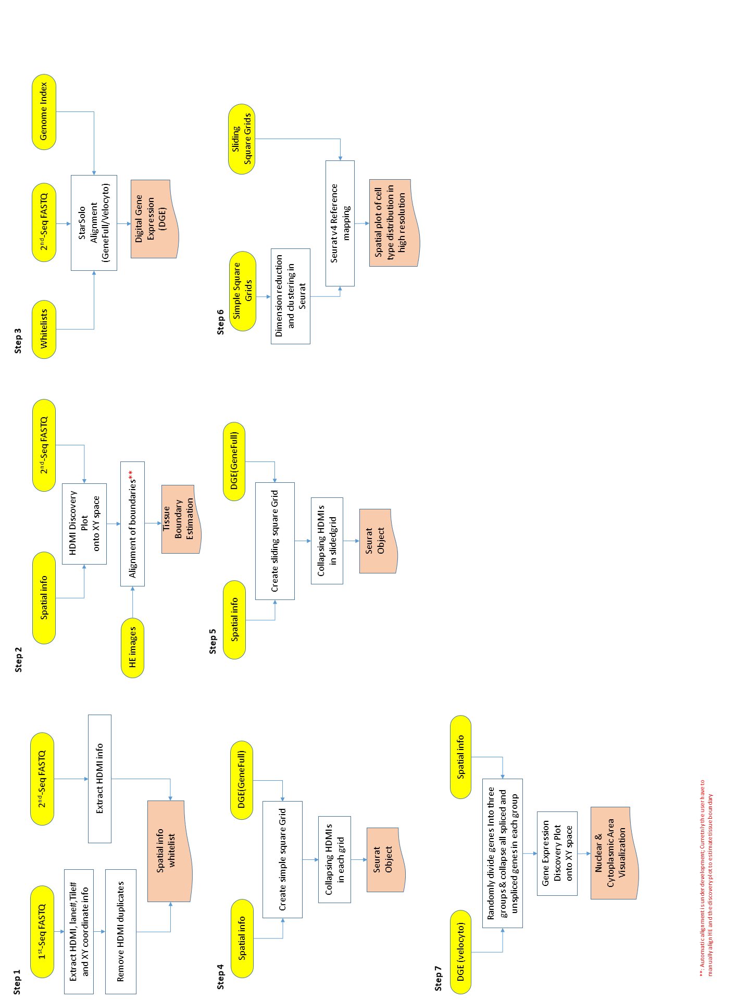

# Spatial Transcriptomic Tools (STtools)
STtools is a package that processes spatial transciriptomics (ST) data from various platform such as [Seq-Scope](https://www.cell.com/cell/fulltext/S0092-8674(21)00627-9?_returnURL=https%3A%2F%2Flinkinghub.elsevier.com%2Fretrieve%2Fpii%2FS0092867421006279%3Fshowall%3Dtrue), [SlideSeq](https://www.cell.com/cell/fulltext/S0092-8674(21)00627-9?_returnURL=https%3A%2F%2Flinkinghub.elsevier.com%2Fretrieve%2Fpii%2FS0092867421006279%3Fshowall%3Dtrue) and [VISIUM](https://www.nature.com/articles/s42003-020-01247-y). This pipleine includes data preprocessing, alignment, collapsing barcodes into 
square gridded datasets and different clustering method such as [Seurat](https://satijalab.org/seurat/articles/spatial_vignette.html) clustering with optional sliding window strategy and [BayesSpace](https://www.nature.com/articles/s41587-021-00935-2).

## Getting Started
STtools is ran in Linux operating system.  The package have flexible options for the user to run either **from the step 1** or run for **consecutive steps** or for **one specific step**. Several examples from various scerios will be given for illustratrion. 
* [Automatic running all steps](./doc/readme1.md)
* [Running consecutive steps](./doc/readme2.md)
* [Running specific step](./doc/readme3.md)

## Overview of STtools

This image below shows the overall workflow for STtools. 

<p align="center">
    
</p>

There are 6 steps, each step takes input from either the raw exapmle data or outputs from previous steps. Please see a brief explanation about each step as follows:
```

* Step 1 takes fastq.gz files as input and output spatial coordinates .txt files and whitelist used for STARsolo alignemnt in the current working directory.
* Step 2 takes in fastq.gz file with barcode info and spatial coordinates file to generate a barcode/HDMI density plot which can be compared with HE images for an estimation of tissue boundary
* Step 3 takes whitelist.txt, transcriptomic fastq.gz files and reference genome as input and runs STARsolo alignment; this step outputs digital expression matrix
* Step 4 takes DGE from Step 3 and output Seurat object with collapsed DGE of simple square grids
* Step 5 takes DGE from Step 3 and output Seurat object with collapsed DGE of square grids from sliding window strategy
* Step 6 takes in RDS file from Step 4 and Step 5 as input and performs dimension reduction, clustering and conducts refernece mapping with simple square grids as query
* Step 7 takes DGE(Velocyto) from Step 3 and generate subcellular plots showing pattern of spliced/unspliced reads
```

## Installation
Linux operatin system is necessary to run STtools package. You also need to install the following software tools and librares/modules before using this package.
* STAR>=2.7.5c (Click for instructions to install [STAR](https://github.com/alexdobin/STAR))
* seqtk (Click for instructions to install [seqtk](https://github.com/lh3/seqtk))
* R>=4.0.0 (STtools will install packages automatically if not installed. Please refer to the  list of [packages](./doc/RPackages))
* Python>= 3.0 (STtools will install modules automatically if not installed, refer to the list of [modules](./doc/PythonModules))
* perl(Click for instructions for installing [perl](https://learn.perl.org/installing/unix_linux.html) )
* pigz(Click for instructions for installing [pigz](https://zlib.net/pigz/))


To install **STtools**, please run:
```
git clone https://github.com/jyxi7676/STtools.git

```


## Example Data
* SeqScope exmaple data for each step can be found at [example data 1](https://drive.google.com/file/d/1e0u57Yu_fVKFvs-UA7WYfj-vgm8Nd2y4/view?usp=sharing), please download the zip files. For each step, the example input data is stored in the corresponding subdirectories. 

* VISIUM digital expresstion data and spatial coordinates are available at [example data 2](https://drive.google.com/drive/folders/130ENNRBEi7kCOXDnGZlHUnuf4CD3_JEI?usp=sharing)
* SeqScope digital expression data and spatial coordinates are avaialbel at [example data 3](https://drive.google.com/drive/folders/1IktkJgDLnYS0fcW65xgHC04S-Mr8ciwf?usp=sharing)

## Input Data Format
Please refer to [data formats](./doc/fileformats.md) for an illustration of required input data format for each step.

## External links
Here are some useful external links:
* To generate gene index for STARsolo alignment: https://hbctraining.github.io/Intro-to-rnaseq-hpc-O2/lessons/03_alignment.html
* Multimodal reference mapping: https://satijalab.org/seurat/articles/multimodal_reference_mapping.html
* Incoporate transgenes to alignment: Please modify the gtf and fasta files according to https://github.com/igordot/genomics/blob/master/workflows/ref-genome-gfp.md before generating  genome  index in STAR.
