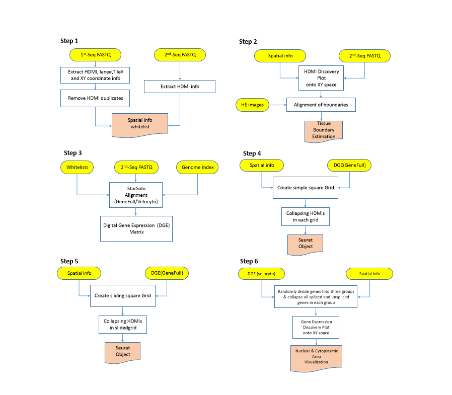

STtools is an package that processing spatial transciriptomics data from various platform such as Seq-Scope and VISIUM. This pipleine includes data preprocessing, alignment, collapsing barcodes into 
gridded datasets and clustering based on classic Seurat methods. 
# Getting Started
## Required operation system and sofware tools
Linux operatin system is necessary.
You need to install the following software tools before using this package .
* STARSolo>=2.7.5c
* seqtk
* R 
* Python >=3.0 (specify libraries)
* perl
* pigz
## Installation


## Example Data

* SeqScope exmaple data can be found at the input directory under each steps(such as /extractCoordinates/input/)

* VISIUM test data is available at:

## Overall Workflow

This image below shows the overall workflow for STtools. There are 6 steps, each step takes input from either outputs from previous steps or the raw exapmle data. Please see the explanation of each steps as follows:
### Step 1: Extract spatial coordinates
### Step 2: Tissue boundary estimation
### Step 3:Alignment
### Step 4: Generate simple square grids
### Step 5: Generate sliding window square grids
### Step 6: Subcellular analysis
### Step 7: Downstreama analysis (add later)
<p align="center">
    
</p>


## User Manual 
* 
* 
```
 python3 sttools_v4.py --run-steps 4 --seq1 '/net/fantasia/home/jyxi/scrna/leejun/ngst/STtools/extractCoord/input/liver-MiSeq-tile2106-sub-R1.fastq.gz' --fq1 '/net/fantasia/home/jyxi/scrna/leejun/ngst/STtools/align/input/liver_tile2106_sub_R1.fastq.gz' --fq2 '/net/fantasia/home/jyxi/scrna/leejun/ngst/STtools/align/input/liver_tile2106_sub_R2.fastq.gz' -g '/net/fantasia/home/jyxi/scrna/leejun/ngst/STtools/geneIndex/' --STtools '/net/fantasia/home/jyxi/scrna/leejun/ngst/STtools/' --star-path '/net/fantasia/home/jyxi/STAR-2.7.5c/source/' --seqtk-path '/net/fantasia/home/jyxi/seqtk/' --py 'python3' --tiles 2106 --sidesize 300 --window 150 -l 20 -o 'Sample' -c 2
```
