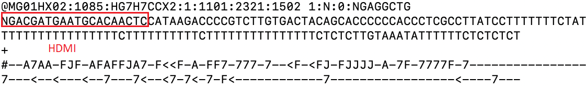
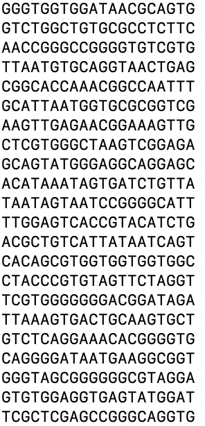

# Input File formarts 
## Step 1
* --first-fq: FASTQ.GZ file. The first N bases are HDMIs. Coordinates information of HDMIs  is stored in the header of FASTQ.GZ file.

    

 

* --second-fq1: FASTQ.GZ file. The first N bases are HDMIs, which are reverse complementary of the HDMIs from --first-fq.

    

 
 
## Step 2
* --HDMI2ndSeq: txt file with only one column, representing the HDMIs from --first-fq. See following:

    

* --spatial: txt file with five columns: HDMI, lane, tile, X and Y (no header). See the following:

    

## Step 3
* --second-fq1: FASTQ.GZ file. See Step 1 --second-fq1 input format.
* --second-fq1: FASTQ.GZ file. The first N bases are randomers or UMIs, followed by cDNA sequences.

    

## Step 4
* --spatial: txt file with five columns: HDMI, lane, tile, X and Y. Same as step 2
* --DGEdir: This path should contain 3 files: barcodes.tsv, features.tsv and matrix.mtx. They are typical format for single cell RNA-seq. The format can be seen at the [link](https://support.10xgenomics.com/single-cell-gene-expression/software/pipelines/latest/output/matrices)
## Step 5
* --spatial:txt file with five columns: HDMI, lane, tile, X and Y. Same as step 2 
* --DGEdir: This path should contain 3 files: barcodes.tsv, features.tsv and matrix.mtx, the same as Step 4.
## Step 6
* --simpleGridsPath: Path to SimpleSquareGrids.RDS. The RDS file will contain the "image" slots with the spatial coordinates and meta data along with the collapsed count data from Step 4.
* --slidingGridsPath: Path to slidingSquareGrids.RDS. The RDS file will contain the "image" slots with the spatial coordinates and meta data along with the collapsed count data from Step 5.

## Step 7
* --spatial: txt file with five columns: HDMI, lane, tile, X and Y.Same as step 2
* --subDGEdir: This path should contain 3 files: barcodes.tsv, features.tsv and matrix.mtx. The first two files are typical file format from scRNA-seq. As for the matrix.mtx, it contain  spliced, unspliced, and ambiguous reads (col3=spliced, col4=unspliced, col5=ambiguous) as the following. 

    

